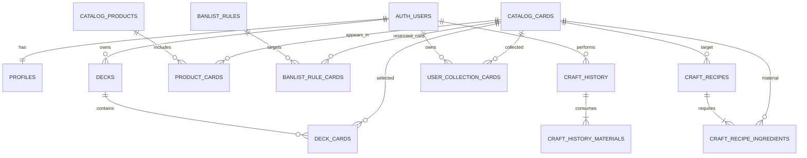

# ออกแบบโครงสร้าง Supabase: Deck Builder, Banlist และคราฟการ์ด PR

**สถานะ:** migration draft สำหรับ Supabase โปรเจกต์ใหม่ ยังไม่ได้เชื่อมต่อหรือแก้ฐานข้อมูลจริง  
**SQL migration:** `supabase/migrations/20261002000000_initial_schema.sql`

## 1. ข้อตกลงที่ใช้ในการออกแบบ

- ใช้ `auth.users` ของ Supabase Auth เป็นบัญชีหลัก และทุกตารางข้อมูลส่วนตัวอ้างถึง `auth.users.id`
- โปรดัก/การ์ดในแค็ตตาล็อกและ Banlist เป็นข้อมูลร่วม ผู้ใช้ที่ล็อกอินจัดการข้อมูลกลางได้ตามสิทธิ์ที่ตกลงไว้ การลบใน UI แนะนำให้เป็น **soft delete** เพื่อกู้คืนได้
- เด็คเป็นส่วนตัวโดยปริยาย เจ้าของเลือกแชร์เป็นรายเด็คพร้อมคำอธิบายได้ ผู้ใช้อื่นอ่านได้เมื่อแชร์ แต่แก้ไขได้เฉพาะเจ้าของ (แบบร่างนี้ให้เฉพาะผู้ใช้ที่ล็อกอินอ่านเด็คที่แชร์)
- สูตรคราฟเป็นสูตรกลางที่ทุกคนอ่านและใช้งานได้ ข้อเสนอด้านสิทธิ์เพื่อป้องกันสูตรของคนอื่นถูกเปลี่ยน: **ผู้สร้างสูตรเป็นผู้แก้ไข/ปิดสูตรนั้นได้**; ผู้ใช้ที่ล็อกอินคนอื่นสร้างสูตรของตัวเองได้
- การ์ดวัตถุดิบและผลคราฟอยู่ในคลังส่วนตัว ห้ามส่ง `user_id` ที่ต้องการแก้จากหน้าเว็บ และไม่เปิดให้ browser เขียนจำนวนการ์ดเข้าคลังโดยตรง

> หากต้องการให้สูตรคราฟแก้ไข/ลบได้โดยผู้ใช้ที่ล็อกอินทุกคนเหมือน Banlist สามารถเปลี่ยนนโยบาย RLS ได้ แต่แบบร่างนี้เลือกให้ผู้สร้างเป็นเจ้าของสูตรเพื่อป้องกันการเปลี่ยนต้นทุนคราฟของผู้อื่น

## 2. ภาพรวมความสัมพันธ์

## 3. ตารางและหน้าที่

| ตาราง | หน้าที่ / ฟิลด์สำคัญ | การมองเห็นและสิทธิ์หลัก |
|---|---|---|
| `profiles` | ชื่อโปรไฟล์สำหรับแสดงตัวตน เช่น `display_name`; ผูก 1:1 กับ `auth.users` | ผู้ใช้ที่ล็อกอินอ่านชื่อโปรไฟล์ได้; เจ้าของแก้ได้เฉพาะแถวตนเอง; ไม่เก็บหรือเปิดเผยอีเมลในฟีด |
| `catalog_products` | ข้อมูลโปรดักและรูปซอง | ข้อมูลกลาง; ผู้ใช้ที่ล็อกอินอ่าน/เพิ่ม/แก้ได้; ลบแบบ soft delete |
| `catalog_cards` | Card List กลาง เช่น หมายเลข ชื่อ เรต Trigger รูป และ `is_gacha_pool` | ข้อมูลกลาง; ผู้ใช้ที่ล็อกอินอ่าน/เพิ่ม/แก้ได้; PR ที่ไม่ต้องการให้สุ่มตั้ง `is_gacha_pool=false` |
| `product_cards` | ตารางเชื่อมหลายต่อหลายระหว่างโปรดักกับการ์ด | ข้อมูลกลาง ใช้กำหนดว่าการ์ดใบใดอยู่ในโปรดักใด |
| `user_gacha_state` | Pity 0–200, จำนวนซองสะสม, และการตั้งค่ารีเซ็ต Pity | อ่าน/แก้ได้เฉพาะบัญชีเจ้าของ; เปลี่ยนผ่าน RPC ที่ตรวจ Auth |
| `gacha_pack_opens`, `gacha_pack_open_cards` | ประวัติเปิดซองส่วนตัวและการ์ด 7 ใบต่อซอง | เจ้าของอ่านได้; สร้างพร้อมเพิ่มคลังผ่าน `record_pack_open()` เท่านั้น |
| `rare_pull_feed_events` | snapshot ผลสุ่ม RRR+ ที่เจ้าของเลือกแชร์ | ผู้ใช้ที่ล็อกอินอ่านได้; สร้างผ่าน `share_rare_pull()` เมื่อเจ้าของกดแชร์เท่านั้น |
| `user_collection_cards` | จำนวนการ์ดแต่ละใบในคลัง เช่น `(user_id, card_id, quantity)` | เจ้าของบัญชีอ่านได้เท่านั้น; เพิ่ม/หักผ่าน RPC ที่ตรวจสอบสิทธิ์ |
| `decks` | เมทาดาทาเด็ค: `owner_id`, `name`, `description`, `is_shared`, `shared_at` | เจ้าของอ่าน/เขียนเด็คตนเอง; ผู้ใช้อื่นอ่านได้เฉพาะเด็คที่แชร์ |
| `deck_cards` | รายการการ์ดและจำนวนในแต่ละโซน เช่น `main`, `ride`, `g`, `token` | อ่านตามสิทธิ์ของเด็ค; เขียนได้เฉพาะเจ้าของเด็ค |
| `banlist_rules` | กฎ `ban`, `zone`, `together`, `limit`; มี `zone_key`, `max_copies`, `deleted_at` | ทุกคนที่ล็อกอินอ่าน/เพิ่ม/แก้/ลบแบบ soft delete ได้ |
| `banlist_rule_cards` | การ์ดเป้าหมายของแต่ละกฎ; กฎ `together` เชื่อมได้หลายใบ | ใช้ร่วมกัน; ทุกคนที่ล็อกอินจัดการรายการการ์ดในกฎได้ |
| `craft_recipes` | สูตรกลาง: `target_card_id`, ชื่อ/คำอธิบาย, จำนวนผลลัพธ์, `is_active`, `created_by` | ทุกคนที่ล็อกอินอ่านและใช้ได้; ผู้สร้างแก้/ปิดสูตรของตนเองตามข้อเสนอ |
| `craft_recipe_ingredients` | วัตถุดิบหนึ่งชนิดต่อสูตร พร้อมจำนวน `quantity` | ทุกคนอ่านได้; ผู้สร้างสูตรจัดการวัตถุดิบในสูตรตนเอง |
| `craft_history` | ประวัติผลคราฟ: ผู้คราฟ สูตร/ชื่อสูตร snapshot การ์ดเป้าหมายและเวลา | อ่านได้เฉพาะเจ้าของ; เขียนโดย RPC เท่านั้น |
| `craft_history_materials` | snapshot วัตถุดิบและจำนวนที่ถูกหักในการคราฟแต่ละครั้ง | อ่านได้เฉพาะเจ้าของประวัติ; ใช้ตรวจสอบย้อนหลัง |

### โครงสร้าง Banlist

`banlist_rules` เก็บชนิดกฎ ส่วน `banlist_rule_cards` เก็บการ์ดเป้าหมาย ทำให้รองรับทั้งกฎที่มีการ์ดใบเดียวและกฎ “ห้ามอยู่ด้วยกัน” ที่มีหลายใบ:

- `ban`: ห้ามใส่ในเด็ค
- `zone`: ห้ามใส่ในโซนที่ระบุ
- `together`: การ์ดอย่างน้อย 2 ใบที่ห้ามอยู่ในเด็คเดียวกัน
- `limit`: จำกัดจำนวน โดยเก็บจำนวนสูงสุดใน `max_copies`

เงื่อนไขว่า `together` ต้องมีอย่างน้อย 2 ใบ และกฎชนิดอื่นต้องมีจำนวน/โซนที่เหมาะสม ควรตรวจในฟอร์มหรือ RPC เพราะเป็นเงื่อนไขข้ามหลายแถว

### โครงสร้างสูตรคราฟ PR

ตัวอย่างสูตรสมมติ: `การ์ด A × 3 + การ์ด B × 2 → การ์ด PR เป้าหมาย × 1` สูตรเดียวมีวัตถุดิบได้หลายชนิด แต่มีได้เพียงหนึ่งแถวต่อการ์ดวัตถุดิบ (`PRIMARY KEY (recipe_id, material_card_id)`) เพื่อรวมจำนวนของการ์ดชนิดเดียวกันให้ชัดเจน

- การ์ดเป้าหมายอยู่ใน `catalog_cards` เหมือนการ์ดอื่น แต่กำหนด `is_gacha_pool=false` ได้ จึงค้นหา/ดูรายละเอียดได้โดยไม่ปะปนใน pool สุ่ม
- ก่อนคราฟ ระบบเทียบ `craft_recipe_ingredients.quantity` กับ `user_collection_cards.quantity` ของผู้ใช้ปัจจุบัน
- เมื่อคราฟสำเร็จ ให้หักวัตถุดิบและเพิ่มการ์ดเป้าหมายเข้า collection ของผู้ใช้คนนั้นเท่านั้น
- `craft_history_materials` เก็บ snapshot จำนวนที่ใช้จริง แม้ภายหลังเจ้าของสูตรจะแก้สูตร

## 4. สิทธิ์ RLS ที่ควรกำหนด

เปิด RLS บนทุกตารางใน schema ที่เปิดผ่าน API และกำหนดทั้ง **GRANT** และ **policy** เพราะ RLS อย่างเดียวไม่ได้ถอนสิทธิ์ที่เคย grant ไว้

| กลุ่ม | SELECT | INSERT / UPDATE / DELETE |
|---|---|---|
| `profiles` | ผู้ใช้ที่ล็อกอินอ่านชื่อโปรไฟล์ | เจ้าของแก้ชื่อของตนเอง |
| โปรดัก/การ์ด/ตารางเชื่อม | ผู้ใช้ที่ล็อกอิน | ผู้ใช้ที่ล็อกอินจัดการข้อมูลกลางได้; ใช้ soft delete |
| `decks` | เจ้าของ หรือผู้ใช้ที่ล็อกอินเมื่อ `is_shared=true` | เจ้าของเท่านั้น |
| `deck_cards` | ตามสิทธิ์อ่านของเด็คแม่ | เจ้าของเด็คเท่านั้น |
| Banlist และการ์ดในกฎ | ผู้ใช้ที่ล็อกอิน | ผู้ใช้ที่ล็อกอินทุกคน; ลบโดยตั้ง `deleted_at` |
| สูตรและส่วนผสม | ผู้ใช้ที่ล็อกอิน | ผู้สร้างสูตรเท่านั้น; สูตรยังเปิดให้อื่นใช้ได้ |
| Collection | เจ้าของบัญชีเท่านั้น | ไม่เปิด DML โดยตรงให้ client; ให้ RPC ฝั่งฐานข้อมูลจัดการ |
| Craft history | เจ้าของบัญชีเท่านั้น | เขียนจาก `craft_card()` เท่านั้น; client แก้ย้อนหลังไม่ได้ |

ฟังก์ชัน `craft_card(recipe_id)` ใช้ `auth.uid()` เลือกบัญชีปัจจุบัน ไม่รับ `user_id` จาก client, ตรวจสูตรและจำนวนวัตถุดิบ, ล็อกแถว inventory, บันทึกประวัติ, หักวัตถุดิบ และเพิ่มผลลัพธ์ในธุรกรรมเดียว หากขั้นตอนใดล้มเหลว PostgreSQL จะ rollback ทั้งรายการ ส่วน `record_pack_open(product_id, card_ids)` ตรวจการ์ดทั้ง 7 ใบกับ pool ของสินค้า เพิ่มจำนวนในคลังและ pack counter พร้อมอัปเดต Pity ในธุรกรรมเดียว; `reset_gacha_pity()` รีเซ็ตเฉพาะบัญชีที่ล็อกอินอยู่

เพื่อไม่ให้มีการใช้วัตถุดิบใบเดียวซ้ำจากการเรียกพร้อมกัน ฟังก์ชันที่แก้ collection ทุกตัว (รวมถึงฟังก์ชันเปิดซองในอนาคต) ควรล็อกแถว `profiles` ของผู้ใช้ก่อนทำงานเหมือนกัน และควรห้าม client เขียน `user_collection_cards` โดยตรง

## 5. กฎ Deck Builder และข้อจำกัดที่ตรวจแบบรวมยอด

`deck_cards` เก็บจำนวนแยกตาม `zone_key` แต่ PostgreSQL `CHECK` ปกติไม่สามารถตรวจผลรวมของหลายแถวได้ จึงให้แอปหรือ `validate_deck(deck_id)` RPC ตรวจ:

- Main Deck ต้องครบ 50 ใบ
- Ride Deck ต้องมีอย่างน้อย 4 ใบ และไม่มีเพดานตายตัว
- Ride Deck นับแยก ไม่หักจำนวน Main Deck
- ตรวจ Banlist จาก `banlist_rules` และ `banlist_rule_cards` ก่อนแสดงผลตรวจเด็ค

## 6. สิ่งที่ยังเป็นข้อเสนอ / ส่วนต่อยอด

1. แบบร่างนี้ตั้งให้ **ผู้สร้างสูตรเป็นผู้แก้/ปิดสูตร** เพื่อไม่ให้ต้นทุนคราฟของทุกคนเปลี่ยนโดยไม่ตั้งใจ; หากต้องการให้ผู้ล็อกอินทุกคนแก้สูตรได้ ค่อยเปลี่ยน policy ของ `craft_recipes` และ `craft_recipe_ingredients`
2. ผู้ชมทั่วไปที่ไม่ล็อกอินยังไม่ได้สิทธิ์อ่านเด็คที่แชร์; SQL นี้จำกัดการอ่านไว้ที่ผู้ล็อกอินตามค่าเริ่มต้น
3. ฟีดผลสุ่มแรร์ถูกวางไว้ใน migration แล้ว: pack/pull history เป็น private และมี public feed row เฉพาะเมื่อเจ้าของเรียก `share_rare_pull()`; ทดสอบ RPC นี้ร่วมกับ RLS ก่อนเปิดใช้จริง
4. กฎ `Main 50 + Ride 4 หรือมากกว่า` และกฎ Banlist ที่เกี่ยวกับหลายแถวควรมี automated tests เพิ่มเติม ไม่ควรพึ่งการตรวจฝั่ง UI อย่างเดียว

## 7. วิธีทดสอบและนำไปใช้

1. ใช้ SQL นี้เป็น migration ใน Supabase local/dev ก่อน ไม่ควรรันบน production โดยตรงก่อนตรวจชื่อ/ตารางที่มีอยู่แล้ว
2. สร้าง test สำหรับทั้ง `anon` และ `authenticated`: เจ้าของอ่านเด็คส่วนตัวได้, บัญชีอื่นอ่านเด็คส่วนตัวไม่ได้, อ่านเด็คที่แชร์ได้แต่แก้ไม่ได้, Banlist อ่าน/เขียนร่วมกันได้, collection/history อ่านข้ามบัญชีไม่ได้
3. ทดสอบคราฟกรณีวัตถุดิบพอ/ไม่พอ, สูตร inactive, เป้าหมายซ้ำกับวัตถุดิบ, และกดคราฟพร้อมกันสองครั้ง
4. ใช้ Supabase migration workflow เก็บ schema เป็นไฟล์ที่มี version แล้วทดสอบด้วย `supabase test db`; อย่าแก้ remote schema ด้วยมือเมื่อเริ่มใช้ migration workflow แล้ว

## แหล่งอ้างอิงทางการ

- [Supabase Row Level Security](https://supabase.com/docs/guides/database/postgres/row-level-security) — แนะนำให้เปิด RLS บนตารางที่เปิดผ่าน API และกำหนดทั้ง grants กับ policies แยกกัน
- [Supabase Database Functions](https://supabase.com/docs/guides/database/functions) — สำหรับ `SECURITY DEFINER` ต้องกำหนด `search_path`; ตัวอย่างนี้ใช้ค่าว่างและอ้าง schema เต็ม
- [Supabase Database Migrations](https://supabase.com/docs/guides/deployment/database-migrations) — เก็บการเปลี่ยน schema เป็น migration และทดสอบก่อน push ไปยังโปรเจกต์จริง
